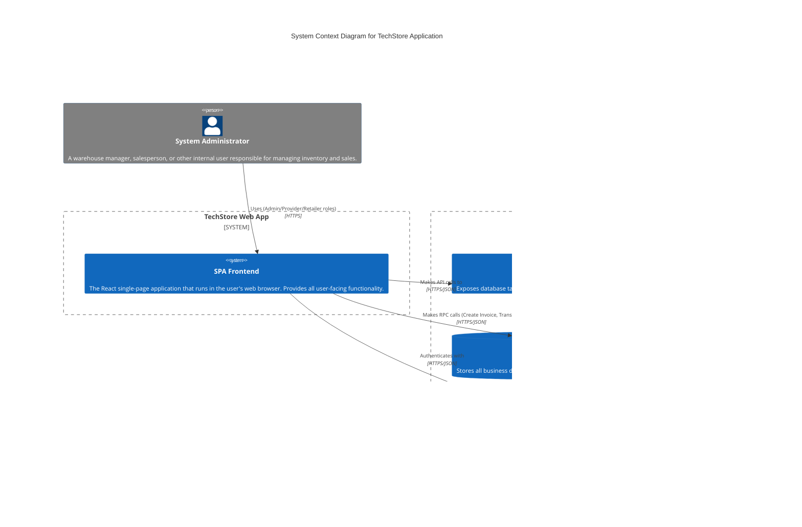

# TechStore: C4 System Context Diagram

This document contains a C4 System Context diagram that describes the high-level architecture of the TechStore application as it currently exists.

## MermaidJS Diagram

## Key Workflows

### 1. Multi-Role Authentication
- **Registration:** Users select their role (Admin, Provider, Retailer) and Warehouse.
- **Auto-Profile:** A database trigger (`handle_new_user`) automatically creates a record in `NHAN_VIEN` linking the Auth UID to the business profile.

### 2. Two-Step Inventory Transfer
- **Initiation:** A `Provider` selects products and a target warehouse to send stock.
- **Notification:** The `Retailer` manager of the target warehouse sees the pending transfer.
- **Action:** The `Retailer` can either **Confirm** (moving stock atomically) or **Decline** (providing a reason).

### 3. Employee Resignation
- Employees marked as `Resigned` in the database are visually flagged in the UI and restricted from performing transactional operations (Invoicing, Transfers).
