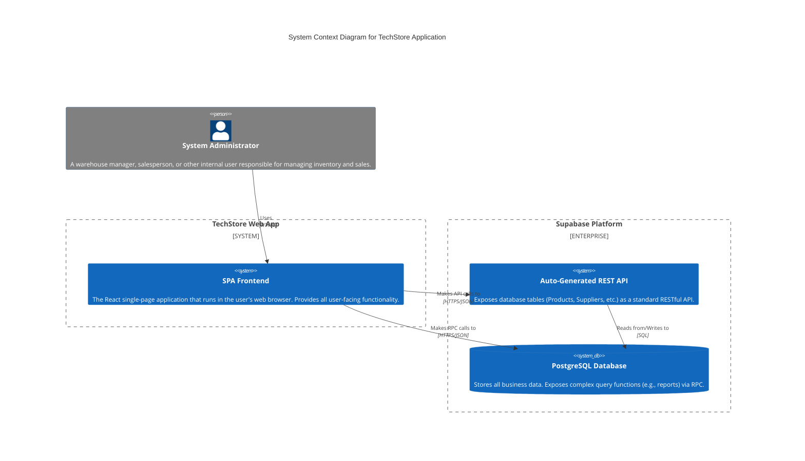

# TechStore: C4 System Context Diagram

This document contains a C4 System Context diagram that describes the high-level architecture of the TechStore application as it currently exists.

## MermaidJS Diagram

